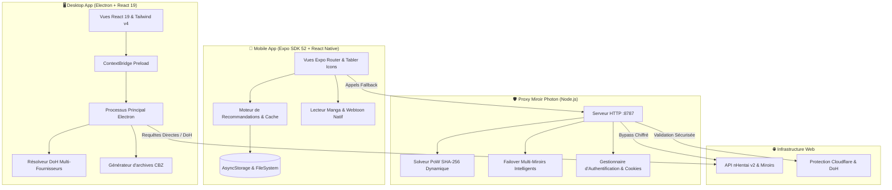

<div align="center">

  

  # 🌸 nHentai Launcher Ecosystem
  ### Client Desktop & Application Mobile Tactile Nouvelle Génération

  <p align="center">
    <strong>L'écosystème open-source ultime, ultra-rapide et anti-blocage pour nHentai.</strong><br>
    <em>Liseuse Manga & Webtoon, Téléchargements CBZ multi-flux avec ComicInfo.xml, Proxy Miroir Photon avec solveur PoW SHA-256 et Bibliothèque hors-ligne.</em>
  </p>

  <p align="center">
    <a href="#-démarrage-rapide--desktop">
      
    </a>
    <a href="#-démarrage-rapide--mobile-expo">
      
    </a>
    <a href="#-proxy-miroir-photon-embarqué">
      
    </a>
  </p>

  <p align="center">
    
    
    
    
    
    
    
    
    
    
  </p>

</div>

---

## 📑 Sommaire

<details open>
<summary><b>Cliquez pour afficher le sommaire complet</b></summary>

- [✨ Points Forts & Vue d'Ensemble](#-points-forts--vue-densemble)
- [📱 Comparatif Fonctionnel Desktop vs Mobile](#-comparatif-fonctionnel-desktop-vs-mobile)
- [📐 Architecture Globale du Monorepo](#-architecture-globale-du-monorepo)
- [🛡️ Proxy Miroir Photon Embarqué](#️-proxy-miroir-photon-embarqué)
- [🚀 Démarrage Rapide : Desktop](#-démarrage-rapide--desktop)
- [📱 Démarrage Rapide : Mobile (Expo)](#-démarrage-rapide--mobile-expo)
- [⌨️ Raccourcis & Gestuelle Tactile](#️-raccourcis--gestuelle-tactile)
- [🏷️ Format Métadonnées ComicInfo.xml](#️-format-métadonnées-comicinfoxml)
- [📂 Structure du Projet](#-structure-du-projet)
- [🧪 Tests & Qualité de Code](#-tests--qualité-de-code)
- [⚠️ Avertissement Légal](#️-avertissement-légal)

</details>

---

## ✨ Points Forts & Vue d'Ensemble

<table>
  <tr>
    <td width="50%">
      <h3>🔍 Moteur de Recherche & Recommandations</h3>
      <ul>
        <li><b>Syntaxe de Recherche Complète :</b> Filtres par tags, artistes, parodies, personnages, langues et exclusions négatives (ex: <code>-guro</code>).</li>
        <li><b>Moteur de Signaux & Affinité :</b> Algorithme prédictif local calculant les recommandations personnalisées selon votre historique et vos favoris.</li>
        <li><b>Navigateur de Taxonomie :</b> Exploration organisée par catégories avec mise en cache optimisée.</li>
        <li><b>Blacklist Intelligente :</b> Masquage automatique ou mode discret (flou NSFW) en un clic.</li>
      </ul>
    </td>
    <td width="50%">
      <h3>📖 Liseuse Double Moteur (Manga & Webtoon)</h3>
      <ul>
        <li><b>Mode Manga :</b> Page par page (RTL / LTR) avec support des planches doubles (Spreads).</li>
        <li><b>Mode Webtoon :</b> Défilement continu haute performance avec gestion de mémoire dynamique.</li>
        <li><b>Plein Écran Immersif Sticky :</b> Masquage fluide des barres d'état et barres de navigation Android.</li>
        <li><b>Tap-to-Turn :</b> Touchez les bords latéraux de l'écran pour tourner les pages sans quitter des yeux votre lecture.</li>
      </ul>
    </td>
  </tr>
  <tr>
    <td width="50%">
      <h3>⚡ Téléchargement Haute Vitesse & CBZ</h3>
      <ul>
        <li><b>Gestionnaire Multi-flux Réglable :</b> Téléchargements parallèles avec suivi du débit (Mo/s) et estimation du temps restant (ETA).</li>
        <li><b>Packaging CBZ & ComicInfo.xml :</b> Génération d'archives standardisées compatibles avec Komga, Kavita et YACReader.</li>
        <li><b>Bibliothèque Hors-Ligne :</b> Lecture instantanée des tomes téléchargés directement depuis le stockage local.</li>
        <li><b>Batch Downloader :</b> Importez et téléchargez des listes massives d'IDs en arrière-plan.</li>
      </ul>
    </td>
    <td width="50%">
      <h3>🛡️ Sécurité, Anti-Blocage & PoW</h3>
      <ul>
        <li><b>Contournement DNS / DoH :</b> Résolution directe via AdGuard, Cloudflare (1.1.1.1), Google ou Quad9 sans modifier le système d'exploitation.</li>
        <li><b>Solveur Cryptographique PoW :</b> Résolution automatique des challenges SHA-256 nHentai en quelques millisecondes.</li>
        <li><b>Passerelle Webview Sécurisée :</b> Validation interactive 1-clic pour franchir les captchas Cloudflare sans friction.</li>
        <li><b>Thème Noir Pur OLED & 25 Teintes :</b> Confort visuel maximal et économie de batterie sur écrans AMOLED.</li>
      </ul>
    </td>
  </tr>
</table>

---

## 📱 Comparatif Fonctionnel Desktop vs Mobile

| Fonctionnalité | 🖥️ Desktop (Electron + React 19) | 📱 Mobile (Expo SDK 52 + React Native) |
|:---|:---:|:---:|
| **Modes de Lecture** | Manga (Simple/Double page) & Webtoon | Manga (RTL/LTR) & Webtoon avec Tap-to-Turn |
| **Plein Écran Immersif** | Touche <kbd>F</kbd> native | Mode Immersif Sticky (`expo-navigation-bar`) |
| **Export CBZ + ComicInfo.xml** | ✅ Enregistrement direct sur disque | ✅ Format local indexé & exportable |
| **Moteur de Recommandations** | ✅ Basé sur l'historique de recherche | ✅ Moteur multi-signaux avec score d'affinité |
| **Téléchargements en Lot (Batch)** | ✅ File d'attente multi-tâches | ✅ Gestionnaire de téléchargement par lot |
| **Gestionnaire de Clés API & Profil** | ✅ Vue dédiée | ✅ Interface native + gestionnaire de clés |
| **Système d'Icônes** | Lucide Icons | Tabler Icons (`@tabler/icons-react-native`) |
| **Onboarding Interactif** | — | ✅ Assistant au premier lancement (DA Manga) |
| **Contournement FAI (DoH / Proxy)** | ✅ DoH intégré dans le Processus Principal | ✅ Proxy Miroir Photon avec solveur PoW |

---

## 📐 Architecture Globale du Monorepo



---

## 🛡️ Proxy Miroir Photon Embarqué

Le proxy local ([`proxy/nhentai-mirror.mjs`](file:///c:/Users/entre/Documents/Dev/nhentaidownlo/proxy/nhentai-mirror.mjs)) est un serveur haute performance conçu pour assurer une disponibilité continue :

- **Résolution PoW (Proof of Work) :** Résout instantanément les défis cryptographiques imposés par l'API v2 de nHentai pour les actions authentifiées.
- **Failover Intelligent :** Bascule automatiquement entre les serveurs miroirs en cas de panne ou de restriction DNS.
- **Support des requêtes partielles (HTTP 206) :** Permet la reprise fluide des téléchargements interrompus (`expo-file-system createDownloadResumable`).
- **Prise en charge de l'authentification native :** Gère la transmission sécurisée des clés API (`X-Api-Key`) et jetons de session (`X-Refresh-Token`).

---

## 🚀 Démarrage Rapide : Desktop

### 1. Prérequis
- [Node.js](https://nodejs.org/) `>= 18.0.0`
- [npm](https://www.npmjs.com/) ou [pnpm](https://pnpm.io/)

### 2. Lancement en Développement
```bash
# À la racine du projet
npm install
npm start
```
> Le serveur Vite démarre sur `http://localhost:1420` et la fenêtre Electron s'ouvre automatiquement.

### 3. Compilation des Exécutables Windows
```bash
npm run dist:win
```
Les installateurs (`.exe` NSIS et version portable) seront générés dans le dossier `release/`.

---

## 📱 Démarrage Rapide : Mobile (Expo)

### 1. Démarrer le Proxy Miroir
```bash
# À la racine du projet
node proxy/nhentai-mirror.mjs
```

### 2. Lancer l'Application Mobile
```bash
cd mobile
npm install
npm start
```

### 3. Exécution sur Appareil / Émulateur
- Appuyez sur <kbd>a</kbd> dans le terminal pour lancer sur **Android Emulator**.
- Ou scannez le QR Code affiché dans votre terminal avec l'application **Expo Go**.

---

## ⌨️ Raccourcis & Gestuelle Tactile

### 🖥️ Raccourcis Clavier Desktop
| Touche | Action | Mode |
|:---|:---|:---|
| <kbd>→</kbd> ou <kbd>D</kbd> | Page suivante (ou double-page suivante) | Manga |
| <kbd>←</kbd> ou <kbd>A</kbd> | Page précédente | Manga |
| <kbd>Espace</kbd> | Défilement / Page suivante | Manga & Webtoon |
| <kbd>F</kbd> | Basculer en Plein Écran | Tous |
| <kbd>M</kbd> | Basculer Simple Page / Double Page | Manga |
| <kbd>W</kbd> | Basculer Mode Manga / Mode Webtoon | Tous |
| <kbd>Échap</kbd> | Quitter la liseuse | Tous |

### 📱 Gestuelle Tactile Mobile
| Geste | Action |
|:---|:---|
| **Tap latéral gauche (28%)** | Page précédente (ou suivante selon le sens RTL/LTR) |
| **Tap latéral droit (28%)** | Page suivante (ou précédente selon le sens RTL/LTR) |
| **Tap central (44%)** | Afficher / Masquer les menus et commandes |
| **Balayage vertical** | Défilement fluide (Mode Webtoon) |
| **Balayage horizontal** | Changement de page fluide (Mode Manga) |

---

## 🏷️ Format Métadonnées ComicInfo.xml

Toutes les galeries téléchargées sous forme de fichiers `.cbz` intègrent automatiquement un fichier `ComicInfo.xml` standardisé :

<details>
<summary><b>Exemple de structure XML</b></summary>

```xml
<?xml version="1.0" encoding="utf-8"?>
<ComicInfo xmlns:xsi="http://www.w3.org/2001/XMLSchema-instance" xmlns:xsd="http://www.w3.org/2001/XMLSchema">
  <Title>[Artiste] Titre de l'œuvre</Title>
  <Series>Nom de la Parodie / Série</Series>
  <Number>673340</Number>
  <Writer>Artiste / Cercle</Writer>
  <Penciller>Artiste</Penciller>
  <Genre>doujinshi, stockings, schoolgirl uniform</Genre>
  <PageCount>33</PageCount>
  <LanguageISO>en</LanguageISO>
  <Web>https://nhentai.net/g/673340/</Web>
  <Manga>YesAndRightToLeft</Manga>
</ComicInfo>
```
</details>

---

## 📂 Structure du Projet

```text
├── 📁 electron/                 # Backend Electron (Processus Principal Desktop)
│   ├── main.cjs                # IPC, téléchargements CBZ, DNS DoH & Scrapers
│   └── preload.cjs             # Bridge contextuel sécurisé
├── 📁 src/                      # Frontend Desktop (React 19 + TypeScript + Tailwind CSS v4)
│   ├── 📁 components/           # Composants Desktop (Liseuse, Téléchargeur, Galeries)
│   ├── 📁 stores/               # Stores d'état Zustand
│   └── App.tsx                 # Racine de l'application Desktop
├── 📁 mobile/                   # Application Mobile (React Native + Expo Router)
│   ├── 📁 app/                  # Routes Expo Router (Index, Read, Book, Settings, Tags...)
│   ├── 📁 components/           # Composants tactiles (BookCard, Modales, Onboarding...)
│   ├── 📁 lib/                  # Logique métier, Moteur de recommandation & Stores
│   └── package.json            # Dépendances Mobile (Expo SDK 52, Tabler Icons)
├── 📁 proxy/                    # Serveur Proxy Miroir Photon
│   └── nhentai-mirror.mjs      # Proxy résilient avec solveur PoW SHA-256
├── 📁 public/                   # Ressources statiques et logos
├── 📄 package.json              # Configuration racine Desktop
└── 📄 README.md                 # Documentation du projet
```

---

## 🧪 Tests & Qualité de Code

```bash
# Vérification des types TypeScript (Desktop)
npx tsc --noEmit

# Vérification des types TypeScript (Mobile)
cd mobile && npx tsc --noEmit

# Suite de tests unitaires du moteur mobile
cd mobile && npm test
```

---

## ⚠️ Avertissement Légal

> [!WARNING]
> Ce projet est un client tiers open-source non-officiel développé à des fins d'apprentissage technique et de recherche personnelle. Il n'est ni affilié, ni sponsorisé, ni approuvé par *nHentai.net*. Les utilisateurs finaux sont entièrement responsables du respect des législations en vigueur dans leur juridiction.

---

<div align="center">
  <sub>Développé avec soin pour la communauté. Sous licence MIT.</sub>
</div>
