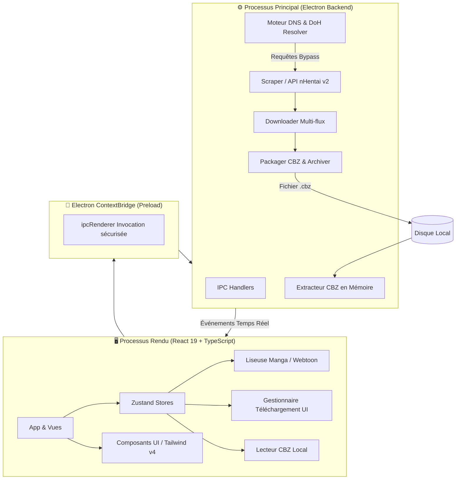
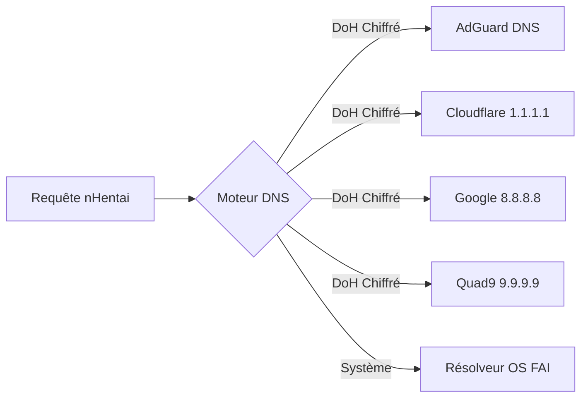

<div align="center">

  

  # 🌸 nHentai Desktop Launcher

  <p align="center">
    <strong>Le client desktop open-source ultime, rapide et ultra-complet pour nHentai.</strong><br>
    <em>Liseuse Manga & Webtoon, Téléchargements CBZ multi-flux avec ComicInfo.xml, Contournement DNS/DoH et Bibliothèque hors-ligne.</em>
  </p>

  <p align="center">
    <a href="#-téléchargement--installation">
      
    </a>
    <a href="#-démarrage-rapide">
      
    </a>
  </p>

  <p align="center">
    
    
    
    
    
    
    
    
  </p>

</div>

---

## 📑 Sommaire

<details open>
<summary><b>Cliquez pour déployer l'index complet</b></summary>

- [✨ Points Forts & Fonctionnalités](#-points-forts--fonctionnalités)
- [🎯 Comparatif des Modes de Lecture](#-comparatif-des-modes-de-lecture)
- [📐 Architecture Technique](#-architecture-technique)
- [⌨️ Raccourcis Clavier](#️-raccourcis-clavier)
- [🚀 Démarrage Rapide](#-démarrage-rapide)
- [📦 Compilation & Packaging](#-compilation--packaging)
- [📜 Scripts NPM](#-scripts-npm)
- [🛡️ Système Réseau & Résolution DNS](#️-système-réseau--résolution-dns)
- [🏷️ Structure des Métadonnées ComicInfo.xml](#️-structure-des-métadonnées-comicinfoxml)
- [📂 Structure du Dépôt](#-structure-du-dépôt)
- [⚠️ Avertissement Légal](#️-avertissement-légal)

</details>

---

## ✨ Points Forts & Fonctionnalités

<table>
  <tr>
    <td width="50%">
      <h3>🔍 Recherche & Découverte</h3>
      <ul>
        <li><b>Recherche Intelligente :</b> Syntaxe complète (<code>#id</code>, <code>tag:</code>, <code>artist:</code>, <code>parody:</code>, <code>character:</code>, <code>group:</code>, <code>language:</code>, <code>-exclude</code>).</li>
        <li><b>Autocomplétion :</b> Suggestions instantanées en direct.</li>
        <li><b>Navigateur de Taxonomie :</b> Parcourez artistes, séries, personnages et groupes avec cache mémoire (TTL 1h).</li>
        <li><b>Filtres Rapides :</b> Sélecteur de langue en 1 clic (🇫🇷, 🇬🇧, 🇯🇵, 🇪🇸, etc.) et tris par popularité.</li>
      </ul>
    </td>
    <td width="50%">
      <h3>📖 Liseuse Double-Moteur</h3>
      <ul>
        <li><b>Mode Manga :</b> Page par page, support natif des planches doubles (Spreads), navigation fluide au clavier.</li>
        <li><b>Mode Webtoon :</b> Défilement vertical continu et infini avec centrage adaptatif et zoom fluide.</li>
        <li><b>Chaîne de Repli Image :</b> Bascule automatique <code>WebP</code> ➔ <code>JPG</code> ➔ <code>PNG</code> en cas d'erreur réseau.</li>
        <li><b>Mini-Rail de Défilement :</b> Saut rapide et aperçu visuel des pages.</li>
      </ul>
    </td>
  </tr>
  <tr>
    <td width="50%">
      <h3>⚡ Téléchargement & Export CBZ</h3>
      <ul>
        <li><b>Multi-flux Haute Vitesse :</b> Gestionnaire de téléchargement parallèle avec concurrence ajustable.</li>
        <li><b>Suivi Temps Réel :</b> Progression par galerie, jauge de vitesse (Ko/s, Mo/s) et estimation du temps restant (ETA).</li>
        <li><b>Export CBZ + ComicInfo.xml :</b> Archives <code>.cbz</code> avec métadonnées compatibles Komga, Kavita, YACReader.</li>
        <li><b>Téléchargement par Lot (Batch) :</b> Traitement asynchrone de listes d'IDs et de recherches complexes.</li>
      </ul>
    </td>
    <td width="50%">
      <h3>📚 Bibliothèque & Anti-Blocage</h3>
      <ul>
        <li><b>Lecteur CBZ Local :</b> Détection et lecture directe d'archives locales sans extraction sur le disque.</li>
        <li><b>Favoris & Historique :</b> Suivi de lecture et sauvegarde persistante.</li>
        <li><b>Contournement DNS Intégré :</b> Moteur DoH / DNS personnalisé (AdGuard, Cloudflare, Google, Quad9).</li>
        <li><b>Bypass Cloudflare :</b> Résolution automatique avec fenêtre d'authentification interactive si nécessaire.</li>
      </ul>
    </td>
  </tr>
</table>

---

## 🎯 Comparatif des Modes de Lecture

```
┌───────────────────────────────────────────────────────────────────────────┐
│                           MODES DE LECTURE                                │
├─────────────────────────────────────┬─────────────────────────────────────┤
│            📖 MODE MANGA            │           📜 MODE WEBTOON           │
├─────────────────────────────────────┼─────────────────────────────────────┤
│ • Page par page ou Double-Page      │ • Défilement vertical continu       │
│ • Navigation clavier (Flèches, A/D) │ • Lecture fluide sans interruptions │
│ • Idéal pour les doujins classiques │ • Optimisé pour manhwas & webtoons  │
│ • Rendu haute définition centré     │ • Largeur de colonne ajustable      │
└─────────────────────────────────────┴─────────────────────────────────────┘
```

---

## 📐 Architecture Technique

Le schéma ci-dessous illustre l'interaction entre l'interface utilisateur, le processus principal Electron et les modules de streaming/téléchargement :



---

## ⌨️ Raccourcis Clavier

Lors de l'utilisation de la **Liseuse intégrée (Online & Offline)** :

| Touche | Action | Mode |
|:---|:---|:---|
| <kbd>→</kbd> ou <kbd>D</kbd> | Page suivante (ou double-page suivante) | Manga |
| <kbd>←</kbd> ou <kbd>A</kbd> | Page précédente | Manga |
| <kbd>Espace</kbd> | Page suivante | Manga |
| <kbd>F</kbd> | Basculer en mode Plein Écran | Manga / Webtoon |
| <kbd>M</kbd> | Basculer entre mode Simple Page et Double-Page | Manga |
| <kbd>W</kbd> | Alterner entre Mode Manga et Mode Webtoon | Tous |
| <kbd>Échap</kbd> | Fermer la liseuse et revenir à la galerie | Tous |

---

## 🚀 Démarrage Rapide

### Prérequis

Assurez-vous d'avoir installé :
- [Node.js](https://nodejs.org/) `>= 18.0.0`
- [npm](https://www.npmjs.com/) (fourni avec Node.js) ou [pnpm](https://pnpm.io/)

### Installation en 3 étapes

```bash
# 1. Cloner le projet
git clone https://github.com/itsnazzym/nHentai-Laucher--unofficial-.git
cd nHentai-Laucher--unofficial-

# 2. Installer les dépendances
npm install

# 3. Lancer en environnement de développement
npm start
```

> [!TIP]
> La commande `npm start` initialise le serveur Vite sur le port `1420` et lance automatiquement la fenêtre Electron dès que le serveur est accessible.

---

## 📦 Compilation & Packaging

Pour compiler l'application et générer les exécutables Windows (installateur NSIS et version portable) :

```bash
npm run dist:win
```

Les exécutables prêts à la distribution se trouveront dans le dossier `release/` :

```text
release/
├── nHentai Launcher Setup 1.0.0.exe    # Installateur Windows complet
├── nHentai Launcher 1.0.0.exe          # Version Standalone / Portable
└── win-unpacked/                       # Dossier des binaires décompressés
```

---

## 📜 Scripts NPM

| Script | Rôle |
|:---|:---|
| `npm start` | **Recommandé :** Démarre Vite en dev et lance Electron de concert |
| `npm run dev` | Démarre uniquement le serveur de développement Vite (`http://localhost:1420`) |
| `npm run build` | Vérifie les types avec `tsc` et compile le frontend dans `dist/` |
| `npm run electron` | Lance le processus Electron indépendamment |
| `npm run dist:win` | Compile le frontend et assemble les installateurs Windows avec `electron-builder` |
| `npm run preview` | Prévisualise la version de production Vite localement |

---

## 🛡️ Système Réseau & Résolution DNS

L'application intègre un résolveur DNS et DoH personnalisable directement depuis l'onglet **Paramètres** pour contrer les blocages au niveau FAI sans altérer la configuration réseau de votre machine :



> [!NOTE]
> La configuration DNS est sauvegardée localement dans le profil utilisateur (`user_dns_settings.json`).

---

## 🏷️ Structure des Métadonnées ComicInfo.xml

Chaque archive `.cbz` générée embarque un fichier XML standardisé `ComicInfo.xml` pour une intégration parfaite dans votre serveur de mangas ou lecteur externe :

<details>
<summary><b>Exemple de ComicInfo.xml généré</b></summary>

```xml
<?xml version="1.0" encoding="utf-8"?>
<ComicInfo xmlns:xsi="http://www.w3.org/2001/XMLSchema-instance" xmlns:xsd="http://www.w3.org/2001/XMLSchema">
  <Title>[Artiste] Titre du Manga</Title>
  <Series>Nom de la Parodie / Série</Series>
  <Number>673340</Number>
  <Writer>Artiste / Cercle</Writer>
  <Penciller>Artiste</Penciller>
  <Genre>big breasts, stockings, schoolgirl uniform</Genre>
  <PageCount>33</PageCount>
  <LanguageISO>en</LanguageISO>
  <Web>https://nhentai.net/g/673340/</Web>
  <Manga>YesAndRightToLeft</Manga>
</ComicInfo>
```
</details>

---

## 📂 Structure du Dépôt

```text
├── 📁 electron/                 # Backend Electron (Processus Principal)
│   ├── main.cjs                # Moteur réseau, IPC, téléchargements CBZ, DNS & Scrapers
│   └── preload.cjs             # Bridge contextuel sécurisé
├── 📁 src/                      # Frontend (React 19 + TypeScript + Tailwind CSS v4)
│   ├── 📁 components/           # Composants UI
│   │   ├── 📁 batch/            # Gestionnaire de téléchargement par lot
│   │   ├── 📁 common/           # Composants réutilisables (SmartImage, Autocomplete, Erreurs)
│   │   ├── 📁 downloader/       # Gestionnaire de téléchargement et files d'attente
│   │   ├── 📁 favorites/        # Gestionnaire de favoris
│   │   ├── 📁 gallery/          # Grille de galeries, cartes, fiches et commentaires
│   │   ├── 📁 history/          # Historique de navigation et reprise de lecture
│   │   ├── 📁 layout/           # En-tête, barre latérale et navigation
│   │   ├── 📁 library/          # Bibliothèque locale & liseuse CBZ hors-ligne
│   │   ├── 📁 reader/           # Liseuse en ligne (Manga, Webtoon, FastScrollRail)
│   │   ├── 📁 settings/         # Configuration (DNS, Chemins, Concurrence)
│   │   └── 📁 taxonomy/         # Explorateur de catégories (Artistes, Tags, Séries...)
│   ├── 📁 stores/               # Stores d'état Zustand (Settings, Favorites, History)
│   ├── 📁 types/                # Définitions TypeScript
│   ├── 📁 utils/                # Utilitaires IPC et fonctions d'aide
│   ├── App.tsx                 # Composant racine et routage interne
│   └── main.tsx                # Point d'entrée React
├── 📁 public/                   # Ressources statiques et icônes
├── 📁 release/                  # Sorties de compilation Electron (ignoré par Git)
├── 📄 .gitignore                # Règles d'exclusion Git complètes
├── 📄 package.json              # Dépendances, scripts et configuration electron-builder
├── 📄 tsconfig.json             # Configuration TypeScript
└── 📄 vite.config.ts            # Configuration du bundler Vite
```

---

## ⚠️ Avertissement Légal

> [!WARNING]
> Ce projet est un client tiers non-officiel développé à des fins de recherche technique et d'apprentissage personnel. Il n'est en aucun cas affilié, entretenu, commandité ou approuvé par *nHentai.net*. L'utilisateur final est seul responsable de l'usage qu'il fait de cette application et du respect des législations en vigueur dans son pays.

---

<div align="center">
  <sub>Développé avec ❤️ par la communauté open-source. Sous licence MIT.</sub>
</div>
