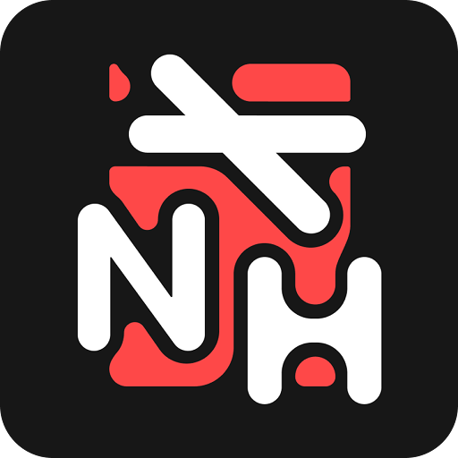
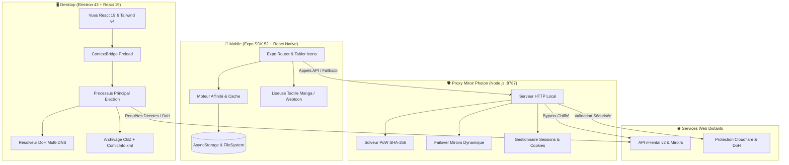

<div align="center">

  

  # 🌸 Yomu Reader
  ### Client Desktop & Application Mobile — une liseuse, une bibliothèque, deux appareils

  <p align="center">
    <strong>Écosystème open-source pour lire, télécharger et reprendre la même page sur téléphone et PC.</strong><br>
    <em>Liseuse Manga & Webtoon, CBZ + ComicInfo.xml, backup JSON partagé, Proxy Miroir Photon (PoW SHA-256).</em>
  </p>

  <p align="center">
    <a href="https://github.com/itsnazzym/yomu-reader/releases/latest">
      
    </a>
  </p>

  <p align="center">
    <a href="https://github.com/itsnazzym/yomu-reader/releases/latest"></a>
    <a href="https://github.com/itsnazzym/yomu-reader/releases/latest"></a>
    <a href="https://github.com/itsnazzym/yomu-reader/releases/latest"></a>
    <a href="https://github.com/itsnazzym/yomu-reader/releases"></a>
  </p>

  <p align="center">
    <a href="#-démarrage-rapide--desktop"></a>
    <a href="#-démarrage-rapide--mobile-expo"></a>
    <a href="#-proxy-miroir-photon"></a>
    <a href="#-architecture"></a>
  </p>

  <p align="center">
    
    
    
    
    
    
    
    
  </p>

</div>

---

## 📑 Navigation Rapide

<details open>
<summary><b>Cliquez pour déplier le sommaire</b></summary>

- [📥 Téléchargements & Releases](#-téléchargements--releases)
- [✨ Points Forts & Fonctionnalités](#-points-forts--fonctionnalités)
- [📱 Comparatif Fonctionnel (Desktop vs Mobile)](#-comparatif-fonctionnel-desktop-vs-mobile)
- [📐 Architecture](#-architecture)
- [🛡️ Proxy Miroir Photon](#️-proxy-miroir-photon)
- [🚀 Démarrage Rapide : Desktop](#-démarrage-rapide--desktop)
- [📱 Démarrage Rapide : Mobile (Expo)](#-démarrage-rapide--mobile-expo)
- [⌨️ Raccourcis & Gestuelle](#️-raccourcis--gestuelle)
- [🏷️ Format Métadonnées ComicInfo.xml](#️-format-métadonnées-comicinfoxml)
- [📂 Structure du Monorepo](#-structure-du-monorepo)
- [🧪 Tests & Qualité](#-tests--qualité)
- [⚠️ Avertissement Légal](#️-avertissement-légal)

</details>

---

## 📥 Téléchargements & Releases

Tous les paquets prêts à l'emploi sont disponibles sur la page **[Releases Officielles](https://github.com/itsnazzym/yomu-reader/releases/latest)** :

| Paquet / Fichier | Plateforme | Description | Téléchargement direct |
| :--- | :--- | :--- | :---: |
| 📱 **`YomuReader-arm64-v8a-release.apk`** | Android 64-bit | Version ultra-légère et fluide (~35 Mo) pour smartphones récents *(Recommandé)* | [⬇️ Télécharger](https://github.com/itsnazzym/yomu-reader/releases/latest) |
| 📱 **`YomuReader-universal-full-release.apk`** | Android Universel | Compatible 100% avec tous les appareils Android (ARMv7, ARM64, x86) | [⬇️ Télécharger](https://github.com/itsnazzym/yomu-reader/releases/latest) |
| 💻 **`YomuReader-Portable.exe`** | Windows 64-bit | Exécutable Desktop portable autonome | [⬇️ Télécharger](https://github.com/itsnazzym/yomu-reader/releases/latest) |
| 🗜️ **`nhentai-launcher-source.zip`** | Tous OS | Archive complète du code source du projet | [⬇️ Télécharger](https://github.com/itsnazzym/yomu-reader/releases/latest) |

---

## ✨ Points Forts & Fonctionnalités

<table>
  <tr>
    <td width="50%" valign="top">
      <h3>🔍 Recherche & Recommandations</h3>
      <ul>
        <li><b>Filtres syntaxiques complets :</b> Recherche par tags, artistes, parodies, personnages, langues et exclusions négatives (ex. <code>-guro</code>).</li>
        <li><b>Moteur d'affinité IA local :</b> Suggestions intelligentes basées sur l'historique de lecture et les favoris.</li>
        <li><b>Blacklist & Mode Discret :</b> Masquage instantané ou floutage NSFW configurable en un clic.</li>
        <li><b>Taxonomie structurée :</b> Navigation par catégories avec mise en cache optimisée.</li>
      </ul>
    </td>
    <td width="50%" valign="top">
      <h3>📖 Liseuse Double Moteur</h3>
      <ul>
        <li><b>Mode Manga :</b> Page par page (RTL / LTR) avec support natif des planches doubles (Spreads).</li>
        <li><b>Mode Webtoon :</b> Défilement continu ultra-fluide avec recyclage mémoire dynamique.</li>
        <li><b>Plein Écran Immersif :</b> Masquage automatique des barres système (Android Sticky Navigation).</li>
        <li><b>Tap-to-Turn :</b> Tournez les pages d'une seule main via les zones tactiles configurables.</li>
      </ul>
    </td>
  </tr>
  <tr>
    <td width="50%" valign="top">
      <h3>⚡ Téléchargement & CBZ Standardisé</h3>
      <ul>
        <li><b>Gestionnaire multi-flux :</b> Téléchargements parallèles avec suivi du débit (Mo/s) et estimation du temps restant (ETA).</li>
        <li><b>Archives CBZ + ComicInfo.xml :</b> Fichiers standardisés compatibles avec Komga, Kavita et YACReader.</li>
        <li><b>Reprise de téléchargement (HTTP 206) :</b> Reprise automatique en cas de coupure réseau.</li>
        <li><b>Bibliothèque Hors-Ligne :</b> Lecture locale instantanée sans connexion internet requise.</li>
      </ul>
    </td>
    <td width="50%" valign="top">
      <h3>🛡️ Sécurité & Contournement Anti-Blocage</h3>
      <ul>
        <li><b>Résolveur DoH Multi-Fournisseurs :</b> Contournement DNS (Cloudflare 1.1.1.1, Google, AdGuard, Quad9).</li>
        <li><b>Solveur PoW SHA-256 :</b> Résolution automatique des défis cryptographiques nHentai en quelques millisecondes.</li>
        <li><b>Passerelle Webview Cloudflare :</b> Validation 1-clic pour franchir les challenges sans blocage.</li>
        <li><b>Thème Pur OLED :</b> 25 teintes d'accentuation et confort visuel maximal pour écrans AMOLED.</li>
      </ul>
    </td>
  </tr>
</table>

---

## 📱 Comparatif Fonctionnel (Desktop vs Mobile)

| Fonctionnalité | 🖥️ Client Desktop (Electron + React 19) | 📱 App Mobile (Expo SDK 54 + React Native) |
| :--- | :---: | :---: |
| **Modes de Lecture** | Manga (Simple / Double planche) & Webtoon | Manga (RTL / LTR) & Webtoon Tap-to-Turn |
| **Mode Immersif** | Plein écran natif (<kbd>F</kbd>) | Immersif Sticky (`expo-navigation-bar`) |
| **Export CBZ & ComicInfo.xml** | ✅ Enregistrement direct sur disque | ✅ Format indexé & exportable |
| **Moteur de Recommandations** | Historique + Continuer | Moteur multi-signaux & score d'affinité |
| **Téléchargement par lot (Batch)** | ✅ File d'attente multi-tâches | ✅ Batch downloader intégré |
| **Sauvegarde / Restauration** | ✅ Export JSON | ✅ Export JSON & partage système natif |
| **Bypass FAI & Anti-Blocage** | ✅ DoH natif dans le Processus Principal | ✅ Proxy Miroir Photon + solveur PoW |
| **Système d'Icônes** | Lucide React | Tabler Icons (`@tabler/icons-react-native`) |

---

## 📐 Architecture



---

## 🛡️ Proxy Miroir Photon

Le proxy embarqué ([`proxy/nhentai-mirror.mjs`](file:///c:/Users/entre/Documents/Dev/nhentaidownlo/proxy/nhentai-mirror.mjs)) garantit une connectivité ininterrompue :

- **⚡ Solveur PoW SHA-256 :** Calcule les nonces cryptographiques requis par l'API v2 en quelques millisecondes.
- **🔄 Basculement Intelligent (Failover) :** Redirige automatiquement le trafic vers les miroirs de secours en cas de restriction DNS ou d'erreur réseau.
- **📥 Support HTTP 206 (Partial Content) :** Permet la reprise fluide des téléchargements volumineux interrompus.
- **🔐 Gestionnaire d'Authentification :** Transmission sécurisée des en-têtes et jetons (`X-Api-Key`, `X-Refresh-Token`).

---

## 🚀 Démarrage Rapide : Desktop

### 1. Prérequis
- [Node.js](https://nodejs.org/) `>= 18.0.0`
- [npm](https://www.npmjs.com/) ou [pnpm](https://pnpm.io/)

### 2. Lancement en Développement
```bash
# À la racine du monorepo
npm install
npm start
```
> Le serveur Vite démarre sur `http://localhost:1420` et la fenêtre Electron s'ouvre automatiquement.

### 3. Compilation des Exécutables Windows (.exe)
```bash
npm run dist:win
```
> Les installateurs NSIS et versions portables sont générés dans le dossier `release/`.

---

## 📱 Démarrage Rapide : Mobile (Expo)

### 1. Démarrer le Proxy Miroir
```bash
npm run proxy
```

### 2. Lancer l'Application Mobile
```bash
cd mobile
npm install
npm start
```

### 3. Exécution sur Appareil / Émulateur
- Tapez <kbd>a</kbd> dans le terminal pour lancer sur **Android Emulator**.
- Ou scannez le **QR Code** avec l'application mobile **Expo Go**.

---

## ⌨️ Raccourcis & Gestuelle

### 🖥️ Raccourcis Clavier Desktop
| Touche | Action | Mode |
| :--- | :--- | :--- |
| <kbd>→</kbd> ou <kbd>D</kbd> | Page suivante (ou spread double-page) | Manga |
| <kbd>←</kbd> ou <kbd>A</kbd> | Page précédente | Manga |
| <kbd>Espace</kbd> | Défilement / Page suivante | Manga & Webtoon |
| <kbd>F</kbd> | Basculer en Plein Écran | Tous |
| <kbd>M</kbd> | Basculer Simple Page / Double Planche | Manga |
| <kbd>W</kbd> | Basculer Mode Manga / Mode Webtoon | Tous |
| <kbd>Échap</kbd> | Quitter la liseuse | Tous |

### 📱 Gestuelle Tactile Mobile
| Zone / Geste | Action Associée |
| :--- | :--- |
| **Tap latéral gauche (28%)** | Page précédente (ou suivante selon le sens RTL/LTR) |
| **Tap latéral droit (28%)** | Page suivante (ou précédente selon le sens RTL/LTR) |
| **Tap central (44%)** | Afficher / Masquer les commandes de lecture |
| **Balayage vertical** | Défilement fluide continu (Mode Webtoon) |
| **Balayage horizontal** | Changement de page fluide (Mode Manga) |

---

## 🏷️ Format Métadonnées ComicInfo.xml

Les galeries exportées au format `.cbz` incluent un fichier `ComicInfo.xml` standardisé pour les serveurs de lecture :

<details>
<summary><b>Afficher la structure XML générée</b></summary>

```xml
<?xml version="1.0" encoding="utf-8"?>
<ComicInfo xmlns:xsi="http://www.w3.org/2001/XMLSchema-instance" xmlns:xsd="http://www.w3.org/2001/XMLSchema">
  <Title>[Artiste] Titre de l'œuvre</Title>
  <Series>Nom de la Parodie / Série</Series>
  <Number>673340</Number>
  <Writer>Artiste / Cercle</Writer>
  <Penciller>Artiste</Penciller>
  <Genre>doujinshi, stockings, schoolgirl uniform</Genre>
  <PageCount>33</PageCount>
  <LanguageISO>en</LanguageISO>
  <Web>https://nhentai.net/g/673340/</Web>
  <Manga>YesAndRightToLeft</Manga>
</ComicInfo>
```
</details>

---

## 📂 Structure du Monorepo

```text
├── 📁 electron/        # Processus Principal Electron (IPC, CBZ, DoH, Scrapers)
├── 📁 src/             # Interface Desktop (React 19 + TypeScript + Tailwind CSS v4)
├── 📁 mobile/          # Application Mobile (React Native + Expo SDK 52 + Expo Router)
│   ├── 📁 app/         # Routes & Écrans (Index, Read, Book, Settings, Tags...)
│   ├── 📁 components/  # Composants tactiles (BookCard, Modales, Onboarding...)
│   └── 📁 lib/         # Stores d'état, Moteur de recommandation & API clients
├── 📁 proxy/           # Serveur Proxy Miroir Photon (Solveur PoW SHA-256 & Failover)
├── 📁 web/             # Portail Web & API Next.js
├── 📁 public/          # Assets statiques et icônes
└── 📄 package.json     # Configuration racine du monorepo
```

---

## 🧪 Tests & Qualité

```bash
# Vérification des types TypeScript (Desktop)
npm run build

# Vérification des types TypeScript (Mobile)
cd mobile && npx tsc --noEmit

# Tests unitaires du moteur mobile
cd mobile && npm test

# Tests unitaires du proxy miroir
npm run test:proxy
```

---

## ⚠️ Avertissement Légal

> [!WARNING]
> Ce projet est un client tiers open-source non-officiel développé à des fins d'apprentissage technique et de recherche personnelle. Il n'est ni affilié, ni sponsorisé, ni approuvé par *nHentai.net*. Les utilisateurs finaux sont entièrement responsables du respect des législations en vigueur dans leur juridiction.

---

<div align="center">
  <sub>Fait avec passion pour la communauté. Sous licence MIT.</sub>
</div>
